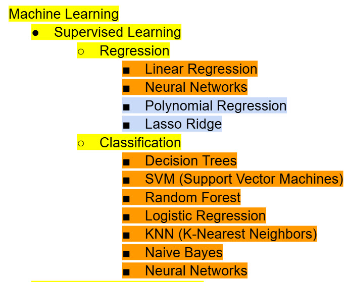
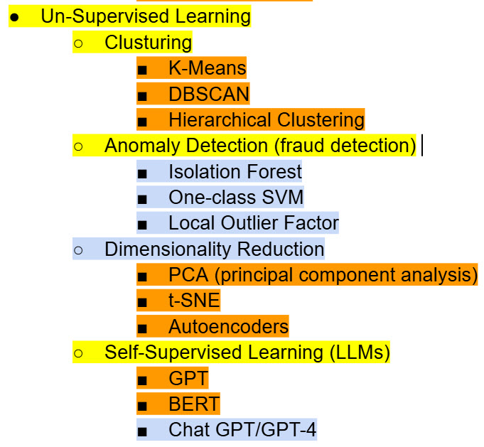

CSE-41287: Linear Algebra for Machine Learning (a part of the UC San Diego Machine Learning Methods Program offered by the extension school)

# linear-algebra-for-machine-learning

Here is a list of the different Machine Learning algorithms (please note that this list is not concrete and I can add changes to it in the future)

**Yellow highlight** = Category of Machine Learning Algorithm

**Orange highlight** = Machine Learning algorithms that only belong to their given category (supervised or unsupervised

**Lightblue highlight** = Machine Learning algorithms that are mainly used in the group that they are assigned to, but can be used in the other category (supervised or unsupervised)

## week 1 Key take aways ([link](https://github.com/hsarfraz/linear-algebra-for-machine-learning/blob/main/week%201/week%201%20lecture%20notes.md))
* dicriminative vs. generative AI
* separation line, regression line, line of best fit, and perceptron
* perceptron line
* linearly separable vs. linear relationship

## week 2 Key take aways ([link](https://github.com/hsarfraz/linear-algebra-for-machine-learning/blob/main/week%202/week%202%20lecture%20notes.md))
* Defining a matrix (2D array), vector (1D or 2D array), and scalar (single number)
* Dot Product
* The Determinant ([Illustration of deteminant](https://www.youtube.com/watch?v=Ip3X9LOh2dk&list=PLZHQObOWTQDPD3MizzM2xVFitgF8hE_ab&index=8))

## week 3 Key take aways ([link](https://github.com/hsarfraz/linear-algebra-for-machine-learning/blob/main/week%203/notes.md))
* Gauss Jordan Elimination
* Using elementary row operations (ERO) in Gauss Jordan Elimination
* Augmented matrix
* Pivots
* Under determined Matrix System of Linear Equations
* Over determined Matrix System of Linear Equations
* Dependent Variables
* Free Variables
* Homogeneous system of linear equations
* Non-homogeneous system of linear equations
* Rank of a matrix after Gauss Jordan Elimination
* Trivial solutions of a system of linear equations
* Non-trivial solutions of a system of linear equations
* Moore Penrose Pseudo Inverse

## week 4 Key take aways ([link](https://github.com/hsarfraz/linear-algebra-for-machine-learning/blob/main/week%204/notes.md))
* Pivot columns
* Subspace
* Span
* Additvity & Homogeneity
* Dilation (scaling)
* L2 Norm (aka the Euclidean norm)
* Null Space
* Contradiction or no contradictions in a matrix in reduced row echelon form (RREF)
* Orthogonal vectors
* Basis of a vector space

## week 5 key take aways ([link](https://github.com/hsarfraz/linear-algebra-for-machine-learning/blob/main/week%205/notes.md))
* scalars
* eigenvectors
* eigenvalues
* matrix transformations (matrix stretch/compress the eigenvectors by different amounts)
* system of linear equations vs. eigenvectors
* ordered basis
* diagonalizable square matrix
* orthogonal vectors
* orthonormal set of vectors

## week 6 key take aways ([link](https://github.com/hsarfraz/linear-algebra-for-machine-learning/tree/main/week%206))
* SVD helps reduces the dimensions of data that has many dimensions
* Fourier transform (FFT)
* Principle Component Analysis (PCA)
* Correlation
* symmetric matrix
* eigenvalues
* eigenvectors
* diagonaalizable
* singular values and their relation with eigenvalues

## week 7 key take aways ([link]())

* PCA (principal component analysis) and it's connection with SVD (singular vector decomposition). Using PCA on images

The key take away here is that Principal Component Analysis (PCA) is a dimensionality reduction technique that helps simplify data, such as images, by keeping only the most important information. Since images contain a large amount of data, PCA focuses on the directions (called principal components) that capture the most variance in the image.

Mathematically, PCA uses Singular Value Decomposition (SVD) to break the image matrix into simpler components. From this decomposition, the eigenvectors with the largest eigenvalues (also called the principal components) are selected, because they represent the directions that contain the most significant features of the image.

## week 8 key take aways ([link]())

* Looking at gradient decent and the normal line method to see which one is more effective is prodicting house prices. The efficiency of both methods is examined through the MSE (mean squared error)

The main key take away is that for **small or simple regression problems**, both gradient descent and the normal equation give the same prediction results. However, for **large or complex datasets**, gradient descent is preferred because it scales better computationally.

## week 9 key take aways ([link]())

* covering linear regression on the MPG dataset and seeing how MSE (mean squared error) is reduced 
